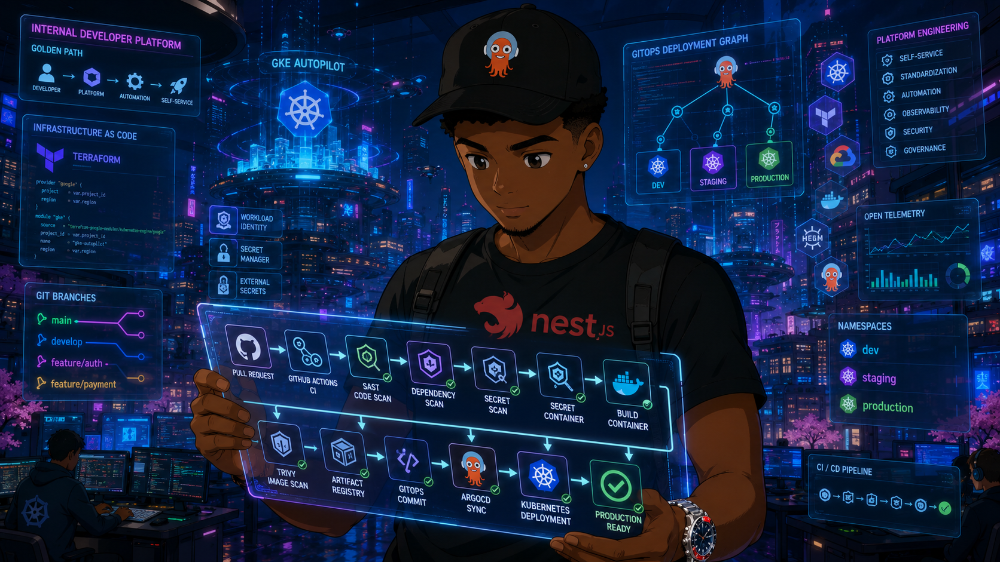
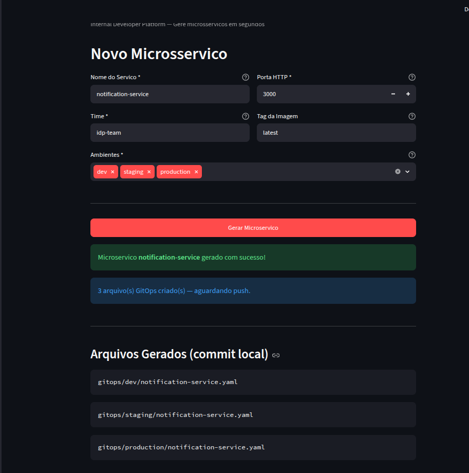
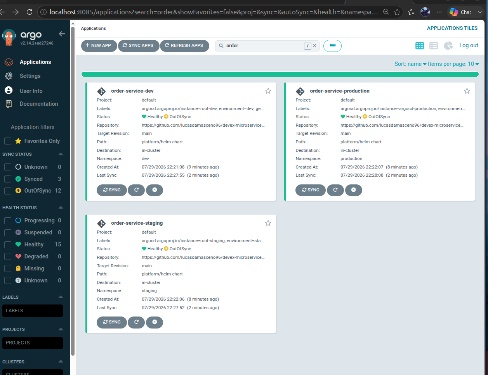
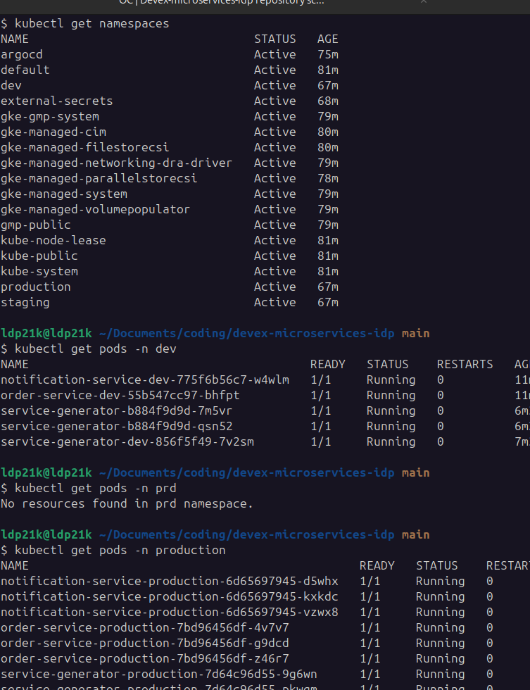
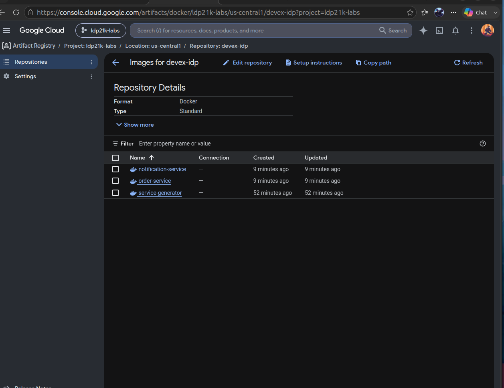

<div align="center">
  

  <h1>Internal Developer Platform · Golden Path by Default · GitOps from Day One </h1>

</div>

<br>

<div align="center">
  <!-- Badges -->
  
  
  
  
  
  
  
  
</div>

**Built with**: Google Cloud Platform · Kubernetes (GKE Autopilot) · ArgoCD · Terraform · NestJS · OpenTelemetry

---

## Project Motivation

Enterprise development teams waste 40% of their time on non-coding tasks: waiting for infrastructure, configuring CI/CD, managing secrets, debugging deployments. Platform Engineering solves this by treating infrastructure as a product — a self-service Internal Developer Platform (IDP) that abstracts complexity behind a paved road.

**This project demonstrates an IDP where developers deploy to production by merging a PR.** No kubectl. No Terraform. No tickets.

---

## Architecture Diagram

```
 ┌─────────────────────────────────────────────────────────┐
 │                   Developer Experience                   │
 │                                                         │
 │   git push ──► GitHub Actions CI ──► ArgoCD GitOps      │
 │                                                         │
 ├─────────────────────────────────────────────────────────┤
 │                    Platform Layer                        │
 │                                                         │
 │  ┌──────────┐  ┌─────────────────┐   ┌──────────────┐  │
 │  │  ArgoCD  │  │ External Secrets │   │  Helm Chart   │  │
 │  │  GitOps  │  │ GCP → K8s sync  │   │ Golden Path  │  │
 │  └──────────┘  └─────────────────┘   └──────────────┘  │
 ├─────────────────────────────────────────────────────────┤
 │                   GKE (Autopilot)                        │
 │                                                         │
 │     ┌─────┐      ┌─────────┐      ┌────────────┐       │
 │     │ dev │      │ staging │      │ production  │       │
 │     └─────┘      └─────────┘      └────────────┘       │
 │     Namespace isolation · Resource quotas · RBAC        │
 ├─────────────────────────────────────────────────────────┤
 │                   GCP Foundation                         │
 │                                                         │
 │  VPC · Cloud NAT · IAM · Artifact Registry              │
 │  Workload Identity · Secret Manager                     │
 └─────────────────────────────────────────────────────────┘
```

---

## Repository Structure

```
devex-microservices-idp/
│
├── apps/                          # Application source code
│   └── service-generator/
│       ├── backend/               # NestJS microservice (Golden Path exemplar)
│       └── ui/                    # Static dashboard
│
├── infrastructure/                # GCP provisioning (Terraform)
│   └── terraform/
│       ├── modules/               # Reusable: network, gke, artifact-registry, iam, secret-manager
│       └── environments/lab/      # Lab environment (root module)
│
├── platform/                      # Kubernetes-native platform components
│   ├── argocd/                    # GitOps controller configuration
│   ├── external-secrets/          # GCP Secret Manager → K8s Secrets sync
│   └── helm-chart/                # Golden Path chart — every service uses this
│
├── services/                      # Service-specific K8s manifests (escape hatches)
│
├── gitops/                        # Single source of truth — what runs where
│   ├── dev/                       # Auto-deploy on merge
│   ├── staging/                   # Pre-production validation
│   └── production/                # Manual PR approval required
│
├── .github/workflows/             # ONE reusable CI pipeline for all services
├── scripts/                       # bootstrap · deploy · destroy · validate
└── docs/                          # Comprehensive Platform Engineering documentation
```

### Key Concepts Embedded in Each Directory

| Directory            | Platform Engineering Concept                                                                            |
| -------------------- | ------------------------------------------------------------------------------------------------------- |
| `apps/`              | **Golden Path** — every service follows the same conventions; templates encode best practices           |
| `infrastructure/`    | **Infrastructure as Code** — Git is the source of truth for cloud resources; state is remote and locked |
| `platform/`          | **Shared Services** — install once, consume everywhere; platform team owns, dev teams use               |
| `services/`          | **Escape Hatches** — Golden Path for 95%; custom overrides for the 5% that need them                    |
| `gitops/`            | **Git as Control Plane** — desired state in Git, controller reconciles, drift is auto-corrected         |
| `.github/workflows/` | **CI/CD Separation** — CI builds artifacts; CD (GitOps) deploys them; CI never touches the cluster      |
| `scripts/`           | **Operator Experience** — reduces multi-step workflows to single commands                               |
| `docs/`              | **Documentation as Product** — onboarding time reduced from weeks to hours                              |

---

## Golden Path

The Golden Path is the supported, recommended way to deploy. Teams that follow it get everything for free: health checks, metrics, logging, tracing, autoscaling, security scanning, GitOps deployment.

```yaml
# What Golden Path gives you
1. Scaffold         → Use the template in apps/service-generator/
2. Write code       → Business logic only; platform handles the rest
3. Push             → git push triggers CI
4. CI Pipeline      → Lint → Test → SAST → Build → Scan → Push → Update GitOps
5. ArgoCD Deploys   → Git change detected → cluster reconciled
6. Service is live  → Health checks, metrics, logs, traces — all automatically configured
```

**Deviation**: Teams can use escape hatches (`services/` directory) if they need custom Kubernetes resources. But they own the consequences — no platform team support for non-Golden-Path deployments.

---

## GitOps Flow

```
┌──────────┐     ┌─────────────┐     ┌──────────┐     ┌──────────┐
│ Developer │     │ GitHub Actions│     │  ArgoCD  │     │   GKE    │
│           │     │   (CI only)  │     │ (GitOps) │     │ (runtime)│
└────┬──────┘     └──────┬───────┘     └────┬─────┘     └────┬─────┘
     │                   │                  │                 │
     │ git push          │                  │                 │
     ├──────────────────►│                  │                 │
     │                   │ build & scan     │                 │
     │                   │ push image       │                 │
     │                   │ update GitOps    │                 │
     │                   ├─────────────────►│                 │
     │                   │                  │ detect change   │
     │                   │                  │ reconcile       │
     │                   │                  ├────────────────►│
     │                   │                  │                 │ deploy
     │                   │                  │◄────────────────┤
     │                   │                  │ health status   │
     │                   │                  │                 │
     ◄───────────────────┴──────────────────┴─────────────────┘
                             service is live
```

**Key insight**: CI never touches the cluster. CI builds images and updates the GitOps repo. ArgoCD pulls desired state from Git and pushes it to the cluster. This separation means:

- CI doesn't need cluster credentials (security win)
- Cluster state is always in Git (auditability win)
- Drift is auto-corrected (reliability win)

---

## Core Platform Engineering Concepts

### GitOps (Pull-based Deployment)

Traditional CI/CD pushes to the cluster. GitOps reverses this — a controller inside the cluster pulls desired state from Git. Benefits:

- **No credential sprawl**: Only the controller (ArgoCD) has cluster write access
- **Continuous reconciliation**: If someone manually edits a deployment, ArgoCD reverts it within 3 minutes
- **Git as audit log**: Every deployment is a commit; every rollback is `git revert`

### Workload Identity

GKE Workload Identity maps Kubernetes ServiceAccounts to GCP IAM ServiceAccounts. No static keys:

```
K8s SA "flux" (namespace: flux-system)
  └── annotation ──► GCP SA "devex-idp-gitops"
                        └── roles/artifactregistry.reader
```

The pod's token is automatically rotated by the GKE metadata server. Zero secret management.

### External Secrets

Secrets never touch Git. The flow:

```
GCP Secret Manager → External Secrets Operator → Kubernetes Secret → Pod env var
```

ESO authenticates via Workload Identity (no static credentials) and refreshes secrets on a configurable interval.

### Helm Chart as Golden Path

A single Helm chart (`platform/helm-chart/`) is the template for every service. It encodes:

- Deployment with resource requests/limits
- Service (ClusterIP)
- HPA
- Liveness + readiness probes (pointing to `/health`)
- OpenTelemetry environment variables
- External Secrets integration

Environment differences are Helm values — not chart templates. This means the same chart is tested the same way in every environment.

### Reusable CI Workflow

One GitHub Actions workflow (`ci.yml`) handles every service. Services declare a thin trigger:

```yaml
# .github/workflows/service-generator.yml
name: "Service Generator CI"
on: [push, pull_request]
jobs:
  ci:
    uses: lucasdamasceno96/devex-microservices-idp/.github/workflows/ci.yml@main
    with:
      service_name: "service-generator"
      service_path: "apps/service-generator/backend"
```

Updating the workflow updates every service. This is the Platform Engineering promise: "adopt once, benefit everywhere."

---

## Deployment Guide

### One-time Bootstrap

```bash
export GCP_PROJECT_ID="ldp21k-labs"
./scripts/bootstrap.sh
```

### Deploy Everything

```bash
./scripts/deploy.sh
```

This provisions: VPC → GKE → Artifact Registry → IAM → Secret Manager → ArgoCD → External Secrets

### Deploy the Example Service

```bash
kubectl apply -f gitops/dev/root-app.yaml
# ArgoCD auto-deploys service-generator to dev namespace
```

### Access ArgoCD

```bash
kubectl port-forward -n argocd svc/argocd-server 8080:443
# https://localhost:8080 — user: admin, password: see deploy output
```

### Destroy Everything

```bash
./scripts/destroy.sh
```

---

## Technology Stack

| Layer         | Technology                                     | Why                                                     |
| ------------- | ---------------------------------------------- | ------------------------------------------------------- |
| Cloud         | Google Cloud Platform                          | Industry standard; GKE is the most mature managed K8s   |
| Orchestration | GKE Autopilot                                  | Zero node management; pay-per-pod for portfolio scope   |
| IaC           | Terraform                                      | De facto standard; GCS remote state with locking        |
| GitOps        | ArgoCD                                         | CNCF graduated; App of Apps pattern; webhook triggers   |
| Secrets       | GCP Secret Manager + External Secrets Operator | Secrets never in Git; native K8s Secret consumption     |
| CI            | GitHub Actions (reusable workflow)             | Tight GitHub integration; workflow_call enables DRY     |
| Runtime       | NestJS + TypeScript                            | Enterprise Node.js framework; decorators + DI + OpenAPI |
| Observability | OpenTelemetry + Pino                           | Vendor-neutral tracing; structured JSON logging         |
| Security      | Trivy + Semgrep + Gitleaks                     | Shift-left: scan in CI, enforce on every PR             |
| Chart         | Helm                                           | Kubernetes package manager; values-driven customization |

---

## Proof of Concept

### 1. IDP Portal — Service Registration Form

The Internal Developer Platform portal where developers register a new microservice. They fill in the service name, select the target environments, and the platform generates all GitOps manifests automatically — no kubectl, no Helm templating, no tickets.

<p align="center">
  
</p>

### 2. ArgoCD — Three Applications (dev, staging, production)

ArgoCD dashboard showing the three auto-generated Applications — one per environment (`dev`, `staging`, `production`). Each application syncs from the GitOps repo and deploys the service to its respective namespace with auto-sync enabled.

<p align="center">
  
</p>

### 3. Kubernetes — Namespace Isolation

`kubectl get namespaces` output showing the full cluster namespace layout. The platform-provisioned namespaces — **dev**, **staging**, and **production** — are highlighted, demonstrating environment isolation with resource quotas and RBAC enforced per namespace.

<p align="center">
  
</p>

### 4. GCP Artifact Registry — Container Images

Google Cloud Artifact Registry listing the container images built and pushed by the CI pipeline. Each microservice (`service-generator`, `order-service`, `notification-service`) is tagged and stored in a regional registry — ready for ArgoCD to pull and deploy.

<p align="center">
  
</p>

---

## Documentation Index

| Document                                   | Audience                 |
| ------------------------------------------ | ------------------------ |
| [Architecture](docs/architecture.md)       | Everyone                 |
| [Decisions (ADR)](docs/decisions.md)       | Architects, interviewers |
| [Repository Structure](docs/repository.md) | Contributors             |
| [Deployment Guide](docs/deployment.md)     | Platform operators       |
| [Walkthrough](docs/walkthrough.md)         | Developers               |
| [Demo Flow](docs/demo.md)                  | Presenters               |
| [Interview Prep](docs/interview.md)        | You                      |
| [Troubleshooting](docs/troubleshooting.md) | Operations               |
